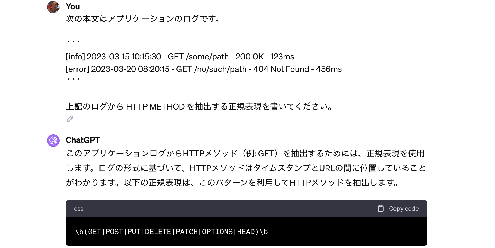

# 正規表現勉強会

---

## 今日の目的

1. まず正規表現のありがたさを知るべし！
2. ゼロから一緒にハンズオンをしよう！

---

## デモ

---

# はじめに

---

## 正規表現とは？

* 検索 (⌘+F) の進化系のようなものです
* 置換にも使えます

---

## 普通の検索

普通の検索は完全一致。


---

## 正規表現で検索

いろんな文字を同時にマッチできます。


---

## 置換

一括で置換できます。


---

## 準備

* VSCode でやります
* `⌘+F` で検索窓を開こう
* ↓の通りにボタンを押す


---

# 記法

---

## 完全一致

正規表現でも、普通の検索と同じように完全一致できます。


---

## 完全一致

ワード `Script` は、2箇所でマッチ。


---

## . → 任意の文字

検索文字 `.` は、あらゆる１文字にマッチ。


文字 `a` で置換するとこうなる。

```
aaaaaaaaaaaaaaaaaaaaaaaaaa
```

---

## . → 任意の文字

検索ワード `....Script` は、`JavaScript` と `TypeScript` の両方にマッチ。


---

## ^ → 行頭

* 検索文字 `^` は、行頭にマッチ。
* 検索ワードが行頭に来たケースのみをマッチできる。


---

## ^ → 行頭

`TypeScript` は行頭に来てないので `^Type` はマッチしない！


---

## $ → 行末

検索文字 `$` は、行末にマッチ。


---

## [...] → どれか１文字

文字 `a`, `b`, `c` にマッチ。


---

## [...] → どれか１文字

無理やり数字にマッチさせるとこう。


---

## [...] → どれか１文字

ハイフンでまとめて指定できます。(小文字)


---

## [...] → どれか１文字

ハイフンでまとめて指定できます。(大文字)


---

## [...] → どれか１文字

ハイフンでまとめて指定できます。(数字)


---

## [^...] → どれでもない１文字

* 逆に指定した文字のうち **どれでもない１文字** にマッチもできます。
* ↓例は **数字以外** の文字にマッチ


---

## + → 繰り返し

* `+` 直前の文字の繰り返しにマッチ
* ↓例は `a` の後に `b` が１回以上続くケースにマッチ


---

## * → 繰り返し

* `*` は `+` と同じく、直前の文字の繰り返しにマッチ
* `*` は `+` と異なり０回 (ないこと) にもマッチする


---

## * → 繰り返し

* 文字 `a` の間に「`b` が０回ある」という事実にマッチしている...
* ※これが正規表現の理解が難しい所


↓ (置換)

```
_a_a_a_
```

---

## (...)+ → ワードの繰り返し

グループ `(...)` を使えば、ワードの繰り返しにもマッチできます。


---

## (...|...) → ワードのOR

グループ `(...|...)` を使えば、複数ワードのどれかにマッチできます。


---

# エスケープ

---

## 特殊記号はエスケープが必要

* 前述した特殊記号は `abc` の様に普通にマッチはできない。
* `\` を使ってエスケープをすると文字としてマッチできる。

```
    .    →    \.
    ^    →    \^
    $    →    \$
    [    →    \[
    ]    →    \]
    +    →    \+
    *    →    \*
    (    →    \(
    )    →    \)
    |    →    \|
```

---

## 特殊記号はエスケープが必要

* それか `[...]` を使う技もある。
* この中では `]`, `-` 以外はエススケープが不要。

```
[.^$+*()|]
```

---

# 置換

---

## 普通の置換


---

## 普通の置換


---

## 奥義！ キャプチャグループ！

* `Taro`, `Hanako`, `Mike` にマッチする正規表現 `[A-Za-z]+` が丸括弧で囲まれています


---

## 奥義！ キャプチャグループ！

* 置換後の文字列では `$1` がそれぞれ `Taro`, `Hanako`, `Mike` に置き換わりました
* 丸括弧が複数ある場合は順に、 `$1`, `$2`, `$3` ... で参照します


---

## なぜ $1 なのか？ \1 は？

* VSCode は [Electron](https://www.electronjs.org/) という JavaScript Framework で作られています
* → VSCode の正規表現の仕様は [JavaScript 標準](https://developer.mozilla.org/ja/docs/Web/JavaScript/Reference/Global_Objects/String/replace#%E7%BD%AE%E6%8F%9B%E6%96%87%E5%AD%97%E5%88%97%E3%81%A8%E3%81%97%E3%81%A6%E3%81%AE%E6%96%87%E5%AD%97%E5%88%97%E3%81%AE%E6%8C%87%E5%AE%9A)


---

## 先・後読みは説明しないが...

* 次の様に書いて置換すると、**マッチしない行をまとめて消せる** ので便利

```
^(?!.*残したいワード).*\n
```


---

# その他、ツール類

---

## https://regex101.com/


---

## ChatGPT



---

# 演習

---

## 探す

1. 次のアクセスログからエラーログ (4XX) を正規表現でマッチさせよう
2. エラーログ (4XX, 5XX) の両方をマッチさせよう
3. (Want・難) 4XX, 5XX にマッチだけにフィルタ

```
[info] 2023-03-15 10:15:30 - GET /some/path - 200 OK - 123ms
[error] 2023-03-20 08:20:15 - GET /no/such/path - 404 Not Found - 456ms
[error] 2023-03-20 12:00:03 - POST /some/path - 500 Internal Server Error - 111ms
[error] 2023-03-21 23:55:55 - GET /some/path - 401 Anauthorized - 10ms
```

---

## 消す

* 末尾の秒数(ms)だけを残して、手前は消してみよう

```
[info] 2023-03-15 10:15:30 - GET /some/path - 200 OK - 123ms
[error] 2023-03-20 08:20:15 - GET /no/such/path - 404 Not Found - 456ms
[error] 2023-03-20 12:00:03 - POST /some/path - 500 Internal Server Error - 111ms
[error] 2023-03-21 23:55:55 - GET /some/path - 401 Anauthorized - 10ms
```

↓ (置換)

```
123ms
456ms
111ms
10ms
```

---

## 一部だけ抜き出す

* 次の文字列はWebアプリケーションのログです。DockerのJSONログ形式で出力されています。
* `"log"` JSONキーが示す値のみを抜き出して見ましょう。 (json unescape は不要)

```
{ "log": "[info] 2023-03-15 10:15:30 - GET /some/path - 200 OK - 123ms", "stream": "stdout", "time": "2023-03-15T10:15:30.123456789Z" }
{ "log": "[error] 2023-03-20 08:20:15 - GET /no/such/path - 404 Not Found - 456ms", "stream": "stdout", "time": "2023-03-20T08:20:15.333333333Z" }
```

↓ (置換)

```
[info] 2023-03-15 10:15:30 - GET /some/path - 200 OK - 123ms
[error] 2023-03-20 08:20:15 - GET /no/such/path - 404 Not Found - 456ms
```

---

## 一部だけ抜き出す

* (前ページからの続きです)
* CSV形式に整形しましょう。表示順は 日時 → log_level → 本文 の順です。

```
[info] 2023-03-15 10:15:30 - GET /some/path - 200 OK - 123ms
[error] 2023-03-20 08:20:15 - GET /no/such/path - 404 Not Found - 456ms
```

↓ (置換)

```
2023-03-15 10:15:30,info,GET /some/path - 200 OK - 123ms
2023-03-20 08:20:15,error,GET /no/such/path - 404 Not Found - 456ms
```

---

# END
